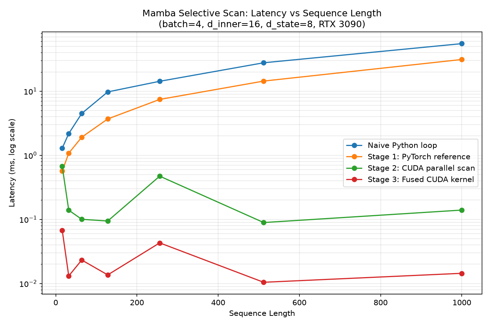

# Mamba Selective Scan — Custom CUDA Kernel

A from-scratch CUDA implementation of the core mathematical engine behind
Mamba (state-space models) — the selective scan mechanism that lets Mamba
process sequences in linear time instead of the quadratic-attention cost of
Transformers. This project implements the full pipeline - a correct PyTorch
reference, a warp-level parallel associative scan, a multi-warp extension
for realistic sequence lengths, and a fully fused single-kernel version that
eliminates intermediate global-memory traffic entirely.

Built as a companion project to [Apex-LOB](#) (an ultra-low-latency
CPU/GPU limit order book) — same underlying skill set (CUDA, memory
management, hardware-aware optimization), applied to ML systems
infrastructure instead of trading.

## Why This Exists

The Mamba selective scan recurrence is inherently **sequential**:

```
h[t] = Ā[t] · h[t-1] + B̄[t] · x[t]
```

Computing `h[t]` requires `h[t-1]`, so a naive implementation forces a
GPU's ~10,000 parallel cores to crawl through a sequence one timestep at a
time. This project solves that with a **parallel associative scan**: by
representing each timestep as a pair `(a, b)` meaning "multiply state by
`a`, then add `b`," the composition of these pairs is associative —

```
(a2,b2) . (a1,b1) = (a2*a1, a2*b1 + b2)
```

— which means the entire sequence's cumulative transformation can be
computed with a parallel scan, the same algorithm family as GPU parallel
prefix-sum, instead of a serial loop.

## Architecture: Three Stages

### Stage 1 — PyTorch Reference (`stage1_reference.py`)
A mathematically transparent, pure-PyTorch implementation of the
Exponential Zero-Order Hold (ZOH) discretization (`Ā = exp(ΔA)`) and the
sequential recurrence. This establishes ground-truth output tensors that
every later stage is checked against.

### Stage 2 — Parallel Associative Scan (`mamba_scan_kernel.cu`)
Two CUDA kernels implementing a Hillis-Steele-style inclusive scan using
warp shuffle primitives (`__shfl_up_sync`) for register-to-register
communication, avoiding slow round-trips to global memory:

- **`warp_scan_forward`** — single-warp scan, sequences up to 32 timesteps.
- **`block_scan_forward`** — extends this to a full block (up to 1024
  timesteps / 32 warps) using a two-level scan: each warp scans its own
  32-timestep chunk independently, then a second pass propagates the
  correct "carry-in" from every earlier warp. Sequences are padded to a
  multiple of 32 with identity values (`Ā=1, B̄=0`) so every thread in
  every warp participates in `__shfl_up_sync` — a hard correctness
  requirement, not an optimization.

### Stage 3 — Fully Fused Kernel (`fused_scan_forward`)
Takes the *raw* Mamba inputs (`u`, `delta`, `A`, `B`, `C`, `D`) directly —
no separate discretization step. `delta` and `u` are loaded into shared
memory **once per `(batch, d_inner)` block** and reused across every state
dimension, instead of being re-read from global memory `d_state` times.
Discretization, the scan, and the output projection (`C · h`) all happen
in registers and shared memory; only the final output touches global
memory.

## Correctness

Every stage is verified against the one before it using `torch.allclose`
with numerical tolerance, not exact equality — parallel floating-point
reduction accumulates rounding error differently than a sequential loop,
so bit-for-bit matching is the wrong bar.

| Test | Result |
|---|---|
| Stage 2 vs. sequential reference (seq_len=16) | max diff `7.2e-7` ✅ |
| Stage 2 multi-warp: 1 warp, 4 warps, non-multiple-of-32 padding, near-max (1000), single-timestep edge case | all ✅ |
| Stage 3 fused kernel vs. original Stage 1 output | max diff `9.5e-7` ✅ |
| Stage 3 fused kernel, larger multi-warp case (seq_len=200) | max diff `7.6e-6` ✅ |

## Benchmarks

`benchmark.py` compares four implementations across sequence lengths
16–1000 (batch=4, d_inner=16, d_state=8, RTX 3090):



At seq_len=1000:

| Comparison | Speedup |
|---|---|
| Fused kernel vs. naive Python loop | 4135x |
| Fused kernel vs. Stage 1 reference | 2003x |
| **Fused kernel vs. Stage 2 (unfused CUDA scan)** | **9.1x** |

The naive-loop and Stage 1 comparisons are dramatic mostly because those
paths are **kernel-launch-overhead-bound** — each Python-level loop
iteration triggers several separate CUDA kernel launches, each paying a
fixed overhead cost regardless of how little work it does. The Stage 2 vs.
Stage 3 comparison is the fairer, more meaningful number: both use the
*identical* scan algorithm, so the 9.1x isolates the specific benefit of
fusing discretization into the scan kernel itself.

## Profiling (Nsight Compute)

Occupancy and hardware utilization scale as expected with problem size —
grid size is `batch × d_inner` (one block per pair), so small
batch/channel counts underutilize the GPU's 82 SMs:

| Metric | Small (batch=4, d_inner=16) | Large (batch=32, d_inner=512) |
|---|---|---|
| Grid Size | 64 blocks | 16,384 blocks |
| Waves Per SM | 0.26 | 66.6 |
| Achieved Occupancy | 33.3% | **99.0%** |
| Compute (SM) Throughput | 22.5% | **87.2–87.6%** |
| Memory Throughput | 22.5% | **87.2–87.3%** |

At small scale, Nsight explicitly flags the grid as too small to fill
available resources (0.3 full waves across all SMs). At production-realistic
scale, occupancy reaches 99% and Nsight reports the kernel as **compute-
and memory-balanced** at ~87% of peak device throughput — confirming the
kernel is genuinely hardware-bound at scale, not limited by its own launch
configuration.

**Takeaway:** the fused kernel's per-block work is efficient, but total
throughput at small model configurations is bottlenecked by insufficient
parallelism, not enough blocks to saturate the GPU, rather than by the
kernel's internal design. A natural next optimization would be splitting
large state dimensions across additional blocks, decoupling grid size from
`batch × d_inner` alone.

## Build & Run

Requires an NVIDIA GPU, CUDA 12.8 toolkit, and PyTorch with matching CUDA
build.

```bash
python3 -m venv .venv
source .venv/bin/activate
pip install torch --index-url https://download.pytorch.org/whl/cu128
pip install matplotlib

# g++ >= 14 is incompatible with CUDA 12.8's nvcc - install an older version:
sudo apt install g++-13
export CC=/usr/bin/gcc-13
export CXX=/usr/bin/g++-13

python3 setup.py build_ext --inplace

python3 stage1_reference.py        # generates ground-truth test case
python3 test_stage2.py             # verify warp-level scan
python3 test_stage2_multiwarp.py   # verify multi-warp scan
python3 test_stage3.py             # verify fully fused kernel
python3 benchmark.py               # latency comparison + plot
```

### Profiling with Nsight Compute

`profile_target.py` runs a single isolated call to the fused kernel for
Nsight Compute to capture (small config by default; pass `large` for a
production-scale config to compare occupancy):

```bash
# WSL2 requires GPU performance counter access to be enabled on the
# Windows host first: NVIDIA Control Panel > Desktop > Developer Settings
# > Manage GPU Performance Counters > allow access to all users,
# then restart the machine.

sudo /usr/local/cuda-12.8/bin/ncu --set basic $(pwd)/.venv/bin/python3 profile_target.py
sudo /usr/local/cuda-12.8/bin/ncu --set basic $(pwd)/.venv/bin/python3 profile_target.py large
```

Note `sudo` uses its own environment, not your active venv/PATH — hence
the explicit full paths to both `ncu` and the venv's Python interpreter.

## Engineering Notes / Debugging Log

A few real hardware/toolchain issues hit and resolved during development,
worth knowing about if reproducing this build:

- **g++ 15 vs. CUDA 12.8**: CUDA 12.8 requires g++ ≤ 13; newer Ubuntu
  ships g++ 15 by default. Fixed by installing `g++-13` alongside the
  system default and pointing the build at it explicitly (`CC`/`CXX`).
- **glibc 2.41 vs. CUDA 12.8 math headers**: newer glibc declares
  `sinpi`/`cospi`/`rsqrt` (and float variants) with `noexcept` specifiers
  that CUDA 12.8's own `math_functions.h` doesn't match, causing a hard
  compile error. NVIDIA has confirmed glibc 2.41 isn't yet supported by
  any current CUDA release; fixed by patching the 6 affected declarations
  in CUDA's header to add matching `noexcept(true)`.
- **WSL2 + Nsight Compute permissions**: profiling requires GPU
  performance counter access, which is disabled by default and gated by a
  **Windows-side** NVIDIA Control Panel setting (`Desktop > Developer
  Settings > Manage GPU Performance Counters`), not fixable from within
  WSL2/Linux alone.
- **`mamba-ssm` dependency conflict**: attempted to benchmark against the
  official reference kernel; its dependency resolution force-upgraded
  PyTorch to a version built against CUDA 13.0, breaking the local build
  (which targets CUDA 12.8) and conflicting with `torchvision`. Reverted
  rather than risk destabilizing the working build for a secondary
  comparison — a reasonable engineering tradeoff given the project's
  actual goals.

## References

- Gu, A. & Dao, T. (2023). [Mamba: Linear-Time Sequence Modeling with
  Selective State Spaces](https://arxiv.org/abs/2312.00752)
- [state-spaces/mamba](https://github.com/state-spaces/mamba) — official
  reference implementation

## Tech Stack

C++20, CUDA 12.8, PyBind11 (via `torch.utils.cpp_extension`), Python,
PyTorch, matplotlib

***
*Developed by **Astin Huynh (astin7)***